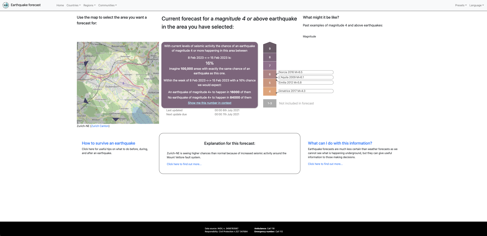

<h1 align="center">RISE - Earthquake forecast</h1>
<p align="center">


</p>

_This website was designed by the [Winton Centre for Risk & Evidence Communication](https://wintoncentre.maths.cam.ac.uk/) at the University of Cambridge, funded by Horizon 2020, as part of the [Work Package 5 (on Society)](http://www.rise-eu.org/activities/society/) of the European project RISE. It aims to display Operational Earthquake Forecasts in a way that is most helpful to a variety of audiences, and was the result of iterative design and testing with over 100 people, in Iceland, Switzerland, and Italy, ranging from seismologists to the general public, journalists to civil protection. The way that the numbers are displayed is the result of quantitative testing with many thousands of members of the general public in California, Switzerland and Iceland. The full reports of the testing and good practice recommendations are found as deliverables of WP5 on the **[RISE website](http://www.rise-eu.org/home/)**._

---
This is a single page web application written in
[clojurescript](https://clojurescript.org/).
The clojurescript compiler generates javascript which runs in an HTML5
capable browser (Chrome, Safari, Firefox, Opera, IE11, Edge). It uses Bootstrap
styling (via react-bootstrap) to achieve a responsive display that adapts to desktop or mobile screen sizes.
<p align="center">
<a></a>
</p>

This project is open-sourced for people to use as a basis for building such a website in production. It features the best practices highlighted in the recommendations mentioned above. The site still contains user testing facilities (presets) but the recommended view resides in _preset 5_. Links can be made to point to new pages of the site.

# Development Quickstart

## Installation

You can quickly get this project running on your local machine.

<details><summary><b>Show installation instructions</b></summary>

* Install [clojure](https://clojure.org/guides/install_clojure) and prerequisites depending on your system (Java notably)
* Install [babashka](https://github.com/babashka/babashka#installation) (optional)
* Install [npm](https://docs.npmjs.com/downloading-and-installing-node-js-and-npm)
* Run `npm run` to view scripts help in `package.json` 

</details>

## Development build (any IDE)

To run the configuration tool, start a shadow-cljs dashboard and start a development build:

```sh
npm run watch-all
```
Open `localhost:9630` for the shadow-cljs dashboard. The `:app` will be served on `localhost:3000` and the `:test-browser` on `localhost:3021`.

To stop your local build:
```sh
npm run stop
```

## Development build using VSCode
Install the Calva extension in VSCode.

Run VSCode command `Calva: Start a Project REPL and Connect (aka Jack-in)` and select `shadow-cljs`.

Check both `:app` and `test-browser` to start both. Connect to the `:app` build on the next prompt. Enable notifications on port 3021.

> To inspect values in code, it is often more convenient to use `tap>` rather than `println`. Results will appear in the dashboard inspectors which allow navigation of run-time data.

>> Requiring `shadow.debug` will provide a slightly higher level interface to `tap>`with useful snapshotting utilities that call `tap>`. See the comment at the end of this file for usage: [shadow.debug](https://github.com/thheller/shadow-cljs/blob/master/src/main/shadow/debug.clj)


# Server build

You can build a production ready version of the code using:
```sh
npm run build
# This command runs shadow-cljs release app under the hood
```

# Deployment

You only need to host the `public/` folder on your servers or 
on a platforms like [Netlify](https://www.netlify.com/) or [surge.sh](https://surge.sh/).

# License

_Copyright ©2022 Winton Centre for Risk & Evidence Communication_

_Distributed under the Eclipse Public License either version 1.0 or (at your option) any later version._